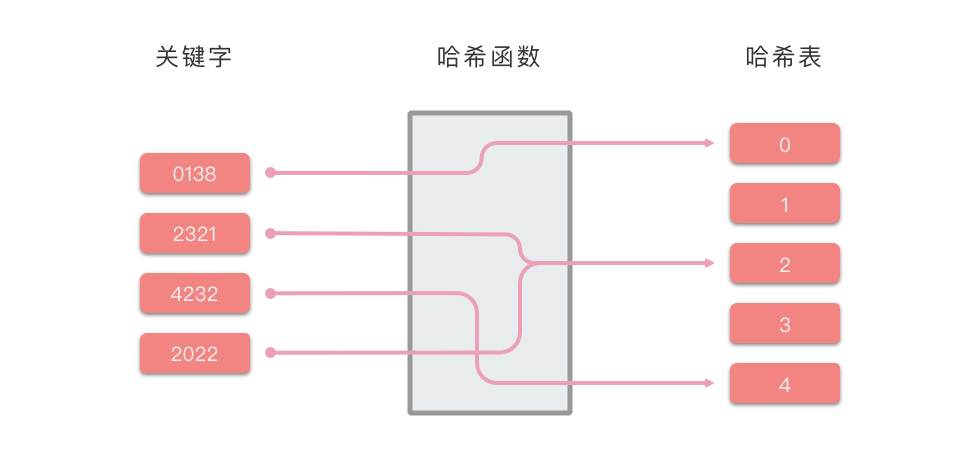
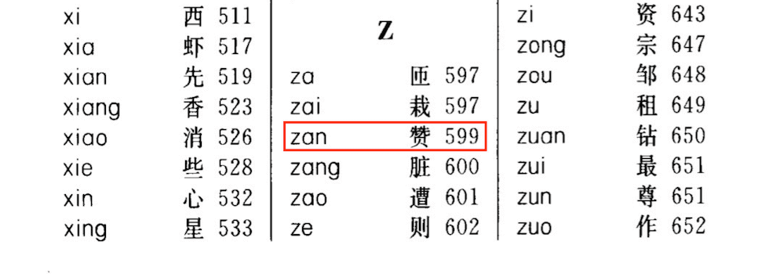
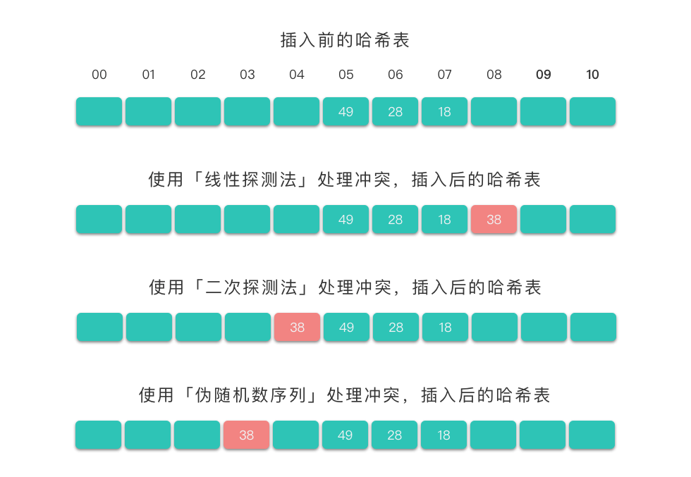

#hashtable 

# 哈希表

## 1. 哈希表简介

> **哈希表（Hash Table）**：也叫做散列表。是根据关键码值（Key Value）直接进行访问的数据结构。
>
> 哈希表通过「键 $key$」和「映射函数 $Hash(key)$」计算出对应的「值 $value$」，把关键码值映射到表中一个位置来访问记录，以加快查找的速度。这个映射函数叫做「哈希函数（散列函数）」，存放记录的数组叫做「哈希表（散列表）」。

哈希表的关键思想是使用哈希函数，将键 $key$ 映射到对应表的某个区块中。我们可以将算法思想分为两个部分：

- **向哈希表中插入一个关键码值**：哈希函数决定该关键字的对应值应该存放到表中的哪个区块，并将对应值存放到该区块中。
- **在哈希表中搜索一个关键码值**：使用相同的哈希函数从哈希表中查找对应的区块，并在特定的区块搜索该关键字对应的值。

哈希表的原理示例图如下所示：



在上图例子中，我们使用 $value = Hash(key) =  key // 1000$ 作为哈希函数。$//$ 符号代表整除。我们以这个例子来说明一下哈希表的插入和查找策略。

- **向哈希表中插入一个关键码值**：通过哈希函数解析关键字，并将对应值存放到该区块中。
  - 比如：$0138$ 通过哈希函数 $Hash(key) = 0138 // 100 = 0$，得出应将 $0138$ 分配到 $0$ 所在的区块中。
- **在哈希表中搜索一个关键码值**：通过哈希函数解析关键字，并在特定的区块搜索该关键字对应的值。
  - 比如：查找 $2321$，通过哈希函数，得出 $2321$ 应该在 $2$ 所对应的区块中。然后我们从 $2$ 对应的区块中继续搜索，并在 $2$ 对应的区块中成功找到了 $2321$。
  - 比如：查找 $3214$，通过哈希函数，得出 $3214$ 应该在 $3$ 所对应的区块中。然后我们从 $3$ 对应的区块中继续搜索，但并没有找到对应值，则说明 $3214$ 不在哈希表中。

哈希表在生活中的应用也很广泛，其中一个常见例子就是「查字典」。

比如为了查找 **「赞」** 这个字的具体意思，我们在字典中根据这个字的拼音索引 `zan`，查找到对应的页码为 $599$。然后我们就可以翻到字典的第 $599$ 页查看 **「赞」** 字相关的解释了。



在这个例子中：

- 存放所有拼音和对应地址的表可以看做是 **「哈希表」**。
- **「赞」** 字的拼音索引 `zan` 可以看做是哈希表中的 **「关键字 $key$」**。
- 根据拼音索引 $zan$ 来确定字对应页码的过程可以看做是哈希表中的 **「哈希函数 $Hash(key)$」**。
- 查找到的对应页码 $599$ 可以看做是哈希表中的 **「哈希地址 $value$」**。

## 2. 哈希函数

> **哈希函数（Hash Function）**：将哈希表中元素的关键键值映射为元素存储位置的函数。

哈希函数是哈希表中最重要的部分。一般来说，哈希函数会满足以下几个条件：

- 哈希函数应该易于计算，并且尽量使计算出来的索引值均匀分布。
- 哈希函数计算得到的哈希值是一个固定长度的输出值。
- 如果 $Hash(key1) \ne Hash(key2)$，那么 $key1$、$key2$ 一定不相等。
- 如果 $Hash(key1) == Hash(key2)$，那么 $key1$、$key2$ 可能相等，也可能不相等（会发生哈希碰撞）。

在哈希表的实际应用中，关键字的类型除了数字类，还有可能是字符串类型、浮点数类型、大整数类型，甚至还有可能是几种类型的组合。一般我们会将各种类型的关键字先转换为整数类型，再通过哈希函数，将其映射到哈希表中。

而关于整数类型的关键字，通常用到的哈希函数方法有：直接定址法、除留余数法、平方取中法、基数转换法、数字分析法、折叠法、随机数法、乘积法、点积法等。下面我们介绍几个常用的哈希函数方法。

### 2.1 直接定址法

- **直接定址法**：取关键字本身 / 关键字的某个线性函数值作为哈希地址。即：$Hash(key) = key$ 或者 $Hash(key) = a \times key + b$，其中 $a$ 和 $b$ 为常数。

这种方法计算最简单，且不会产生冲突。适合于关键字分布基本连续的情况，如果关键字分布不连续，空位较多，则会造成存储空间的浪费。

举一个例子，假设我们有一个记录了从 $1$ 岁到 $100$ 岁的人口数字统计表。其中年龄为关键字，哈希函数取关键字自身，如下表所示。

| 年龄 |  1   |  2   |  3   | ...  |  25  |  26  |  27  | ...  | 100  |
| :--: | :--: | :--: | :--: | :--: | :--: | :--: | :--: | :--: | :--: |
| 人数 | 3000 | 2000 | 5000 | ...  | 1050 | ...  | ...  | ...  | ...  |

比如我们想要查询 $25$ 岁的人有多少，则只要查询表中第 $25$ 项即可。

### 2.2 除留余数法

- **除留余数法**：假设哈希表的表长为 $m$，取一个不大于 $m$ 但接近或等于 $m$ 的质数 $p$，利用取模运算，将关键字转换为哈希地址。即：$Hash(key) = key \mod p$，其中 $p$ 为不大于 $m$ 的质数。

这也是一种简单且常用的哈希函数方法。其关键点在于 $p$ 的选择。根据经验而言，一般 $p$ 取素数或者 $m$，这样可以尽可能的减少冲突。

比如我们需要将 $7$ 个数 $[432, 5, 128, 193, 92, 111, 88]$ 存储在 $11$ 个区块中（长度为 $11$ 的数组），通过除留余数法将这 $7$ 个数应分别位于如下地址：

| 索引 | 00  | 01  | 02  | 03  | 04  | 05  | 06  | 07  | 08  | 09  | 10  |
| :--: | :-: | :-: | :-: | :-: | :-: | :-: | :-: | :-: | :-: | :-: | :-: |
| 数据 | 88  | 111 |     | 432 | 92  |  5  | 193 |     | 128 |     |     |

### 2.3 平方取中法

- **平方取中法**：先通过求关键字平方值的方式扩大相近数之间的差别，然后根据表长度取关键字平方值的中间几位数为哈希地址。
  - 比如：$Hash(key) = (key \times key) // 100 \mod 1000$，先计算平方，去除末尾的 $2$ 位数，再取中间 $3$ 位数作为哈希地址。

这种方法因为关键字平方值的中间几位数和原关键字的每一位数都相关，所以产生的哈希地址也比较均匀，有利于减少冲突的发生。

### 2.4 基数转换法

- **基数转换法**：将关键字看成另一种进制的数再转换成原来进制的数，然后选其中几位作为哈希地址。
  - 比如，将关键字看做是 $13$ 进制的数，再将其转变为 $10$ 进制的数，将其作为哈希地址。

以 $343246$ 为例，哈希地址计算方式如下：

$343246_{13} = 3 \times 13^5 + 4 \times 13^4 + 3 \times 13^3 + 2 \times 13^2 + 4 \times 13^1 + 6 \times 13^0 = 1235110_{10}$

## 3. 哈希冲突

> **哈希冲突（Hash Collision）**：不同的关键字通过同一个哈希函数可能得到同一哈希地址，即 $key1 \ne key2$，而 $Hash(key1) == Hash(key2)$，这种现象称为哈希冲突。

理想状态下，我们的哈希函数是完美的一对一映射，即一个关键字（$key$）对应一个值（$value$），不需要处理冲突。但是一般情况下，不同的关键字 $key$ 可能对应了同一个值 $value$，这就发生了哈希冲突。

设计再好的哈希函数也无法完全避免哈希冲突。所以就需要通过一定的方法来解决哈希冲突问题。常用的哈希冲突解决方法主要是两类：**「开放地址法（Open Addressing）」** 和 **「链地址法（Chaining）」**。

### 3.1 开放地址法

> **开放地址法（Open Addressing）**：指的是将哈希表中的「空地址」向处理冲突开放。当哈希表未满时，处理冲突时需要尝试另外的单元，直到找到空的单元为止。

当发生冲突时，开放地址法按照下面的方法求得后继哈希地址：$H(i) = (Hash(key) + F(i)) \mod m$，$i = 1, 2, 3, ..., n (n ≤ m - 1)$。
- $H(i)$ 是在处理冲突中得到的地址序列。即在第 1 次冲突（$i = 1$）时经过处理得到一个新地址 $H(1)$，如果在 $H(1)$ 处仍然发生冲突（$i = 2$）时经过处理时得到另一个新地址 $H(2)$ …… 如此下去，直到求得的 $H(n)$ 不再发生冲突。
- $Hash(key)$ 是哈希函数，$m$ 是哈希表表长，对哈希表长取余的目的是为了使得到的下一个地址一定落在哈希表中。
- $F(i)$ 是冲突解决方法，取法可以有以下几种：
  - 线性探测法：$F(i) = 1, 2, 3, ..., m - 1$。
  - 二次探测法：$F(i) = 1^2, -1^2, 2^2, -2^2, ..., \pm n^2(n \le m / 2)$。
  - 伪随机数序列：$F(i) = \text{伪随机数序列}$。


举个例子说说明一下如何用以上三种冲突解决方法处理冲突，并得到新地址 $H(i)$。例如，在长度为 $11$ 的哈希表中已经填有关键字分别为 $28$、$49$、$18$ 的记录（哈希函数为 $Hash(key) = key \mod 11$）。现在将插入关键字为 $38$ 的新纪录。根据哈希函数得到的哈希地址为 $5$，产生冲突。接下来分别使用这三种冲突解决方法处理冲突。

#### 线性探测法
- 得到下一个地址 $H(1) = (5 + 1) \mod 11 = 6$，仍然冲突；继续求出 $H(2) = (5 + 2) \mod 11 = 7$，仍然冲突；继续求出 $H(3) = (5 + 3) \mod 11 = 8$，$8$ 对应的地址为空，处理冲突过程结束，记录填入哈希表中序号为 $8$ 的位置。
- code
```Python
def linear_probing(hash_table,key): 
    size = len(hash_table) 
    hash_address  = key % size
    while hash_table[hash_address] is not None : 
        hash_address = (hash_address+1) % size 
        
    hash_table[hash_address] = key 
    
    
hash_table = [None] * 11 
keys = [28,49,18]
for key in keys : 
    linear_probing(hash_table,key) 
# 插入38 解决哈希冲突 
linear_probing(hash_table,38)
print("Linear Probing:",hash_table)
```
- ### 二次探测法 
- 得到下一个地址 $H(1) = (5 + 1 \times 1) \mod 11 = 6$，仍然冲突；继续求出 $H(2) = (5 - 1 \times 1) \mod 11 = 4$，$4$ 对应的地址为空，处理冲突过程结束，记录填入哈希表中序号为 $4$ 的位置。
- code
```python
def quadratic_probing(hash_table,key) : 
    
    size = len(hash_table) 
    hash_address = key % size 
    i = 1 
    while hash_table[hash_address] is not None : 
        # 正向寻找
        new_hash_address  =   (key + i*i) % size 
        if hash_table[new_hash_address] is None : 
            hash_address = new_hash_address 
            break 
        
        # 负向寻找
        new_hash_address = (key - i*i) % size 
        if hash_table[new_hash_address] is None  : 
            hash_address = new_hash_address 
            break 
        
        i += 1 
        
    hash_table[hash_address] = key 
    
    
hash_table = [None] * 11 
keys = [28,49,18]
for key in keys : 
    quadratic_probing(hash_table,key) 
# 插入38 解决哈希冲突 
quadratic_probing(hash_table,38)
print("Quadratic Probing:",hash_table)
```
### 伪随机数序列
- 假设伪随机数为 $9$，则得到下一个地址 $H(1) = (9 + 5) \mod 11 = 3$，$3$ 对应的地址为空，处理冲突过程结束，记录填入哈希表中序号为 $3$ 的位置。
- code

```python
import random 
def pseudo_random_probing(hash_table,key,seed = 42) : 
    random.seed(seed)
    size = len(hash_table) 
    hash_address = key % size 
    while hash_table[hash_address] is not None : 
        
        hash_address = (hash_address + random.randint(1,size-1)) % size 
        
        
    hash_table[hash_address] = key 
    
    
hash_table = [None] * 11 
keys = [28,49,18]
for key in keys : 
    pseudo_random_probing(hash_table,key) 
# 插入38 解决哈希冲突 
pseudo_random_probing(hash_table,38)
print("Quadratic Probing:",hash_table)
```

使用这三种方法处理冲突的结果如下图所示：



### 3.2 链地址法

> **链地址法（Chaining）**：将具有相同哈希地址的元素（或记录）存储在同一个线性链表中。

链地址法是一种更加常用的哈希冲突解决方法。相比于开放地址法，链地址法更加简单。

我们假设哈希函数产生的哈希地址区间为 $[0, m - 1]$，哈希表的表长为 $m$。则可以将哈希表定义为一个有 $m$ 个头节点组成的链表指针数组 $T$。

- 这样在插入关键字的时候，我们只需要通过哈希函数 $Hash(key)$ 计算出对应的哈希地址 $i$，然后将其以链表节点的形式插入到以 $T[i]$ 为头节点的单链表中。在链表中插入位置可以在表头或表尾，也可以在中间。如果每次插入位置为表头，则插入操作的时间复杂度为 $O(1)$。

- 而在在查询关键字的时候，我们只需要通过哈希函数 $Hash(key)$ 计算出对应的哈希地址 $i$，然后将对应位置上的链表整个扫描一遍，比较链表中每个链节点的键值与查询的键值是否一致。查询操作的时间复杂度跟链表的长度 $k$ 成正比，也就是 $O(k)$。对于哈希地址比较均匀的哈希函数来说，理论上讲，$k = n // m$，其中 $n$ 为关键字的个数，$m$ 为哈希表的表长。

举个例子来说明如何使用链地址法处理冲突。假设现在要存入的关键字集合 $keys = [88, 60, 65, 69, 90, 39, 07, 06, 14, 44, 52, 70, 21, 45, 19, 32]$。再假定哈希函数为 $Hash(key) = key \mod 13$，哈希表的表长 $m = 13$，哈希地址范围为 $[0, m - 1]$。将这些关键字使用链地址法处理冲突，并按顺序加入哈希表中（图示为插入链表表尾位置），最终得到的哈希表如下图所示。


```Python
class Node :
    def __init__(self,key):
        self.key  = key 
        self.next = None 
        
class HashTable : 
    def __init__(self,size):
        self.size = size 
        self.table = [None] * size 
    def hash_function(self,key) : 
        return key % self.size   
    
    def insert(self,key)  : 
        
        hash_address = self.hash_function(key) 
        if self.table[hash_address] is None : 
              self.table[hash_address] = Node(key) 
        else: 
            current = self.table[hash_address]
            while current.next is not None : 
                current = current.next 
                
            current.next = Node(key)
            
    def display(self) : 
        for i,node in enumerate(self.table) : 
            print(f"Index {i} : ",end = "")
            current = node 
            while current  : 
                print(f"{current.key} -> ",end = "")
                current = current.next 
            print("None")        
        
        
    
# 初始化哈希表
hash_table_size = 13 
hash_table = HashTable(hash_table_size)   
# 插入键值集合
keys = [88, 60, 65, 69, 90, 39, 7, 6, 14, 44, 52, 70, 21, 45, 19, 32] 
for key in keys: 
    hash_table.insert(key) 
# 打印哈希表
hash_table.display() 
```


相对于开放地址法，采用链地址法处理冲突要多占用一些存储空间（主要是链节点占用空间）。但它可以减少在进行插入和查找具有相同哈希地址的关键字的操作过程中的平均查找长度。这是因为在链地址法中，待比较的关键字都是具有相同哈希地址的元素，而在开放地址法中，待比较的关键字不仅包含具有相同哈希地址的元素，而且还包含哈希地址不相同的元素。

## 4. 哈希表总结

本文讲解了一些比较基础、偏理论的哈希表知识。包含哈希表的定义，哈希函数、哈希冲突以及哈希冲突的解决方法。

- **哈希表（Hash Table）**：通过键 $key$ 和一个映射函数 $Hash(key)$ 计算出对应的值 $value$，把关键码值映射到表中一个位置来访问记录，以加快查找的速度。
- **哈希函数（Hash Function）**：将哈希表中元素的关键键值映射为元素存储位置的函数。
- **哈希冲突（Hash Collision）**：不同的关键字通过同一个哈希函数可能得到同一哈希地址。

哈希表的两个核心问题是：**「哈希函数的构建」** 和 **「哈希冲突的解决方法」**。

- 常用的哈希函数方法有：直接定址法、除留余数法、平方取中法、基数转换法、数字分析法、折叠法、随机数法、乘积法、点积法等。
- 常用的哈希冲突的解决方法有两种：开放地址法和链地址法。


## 5. leetcdoe热题
1. [哈希表：242.有效的字母异位词](https://github.com/youngyangyang04/leetcode-master/blob/master/problems/0242.%E6%9C%89%E6%95%88%E7%9A%84%E5%AD%97%E6%AF%8D%E5%BC%82%E4%BD%8D%E8%AF%8D.md)
2. [哈希表：1002.查找常用字符](https://github.com/youngyangyang04/leetcode-master/blob/master/problems/1002.%E6%9F%A5%E6%89%BE%E5%B8%B8%E7%94%A8%E5%AD%97%E7%AC%A6.md)
3. [哈希表：349.两个数组的交集](https://github.com/youngyangyang04/leetcode-master/blob/master/problems/0349.%E4%B8%A4%E4%B8%AA%E6%95%B0%E7%BB%84%E7%9A%84%E4%BA%A4%E9%9B%86.md)
4. [哈希表：202.快乐数](https://github.com/youngyangyang04/leetcode-master/blob/master/problems/0202.%E5%BF%AB%E4%B9%90%E6%95%B0.md)
5. [哈希表：1.两数之和](https://github.com/youngyangyang04/leetcode-master/blob/master/problems/0001.%E4%B8%A4%E6%95%B0%E4%B9%8B%E5%92%8C.md)
6. [哈希表：454.四数相加II](https://github.com/youngyangyang04/leetcode-master/blob/master/problems/0454.%E5%9B%9B%E6%95%B0%E7%9B%B8%E5%8A%A0II.md)
7. [哈希表：383.赎金信](https://github.com/youngyangyang04/leetcode-master/blob/master/problems/0383.%E8%B5%8E%E9%87%91%E4%BF%A1.md)
8. [哈希表：15.三数之和](https://github.com/youngyangyang04/leetcode-master/blob/master/problems/0015.%E4%B8%89%E6%95%B0%E4%B9%8B%E5%92%8C.md)
9. [哈希表：18.四数之和](https://github.com/youngyangyang04/leetcode-master/blob/master/problems/0018.%E5%9B%9B%E6%95%B0%E4%B9%8B%E5%92%8C.md)
10.  [205.同构字符串](https://github.com/youngyangyang04/leetcode-master/blob/master/problems/0205.%E5%90%8C%E6%9E%84%E5%AD%97%E7%AC%A6%E4%B8%B2.md):【哈希表的应用】
## 参考资料

- 【博文】[哈希算法及 python 字典的实现 – Tim's Path](https://xiaoxubeii.github.io/articles/hash/)
- 【文章】[哈希表 - LeetBook - 力扣（LeetCode）](https://leetcode.cn/leetbook/read/hash-table/xh8uld/)
- 【文章】[漫画算法 - 小灰的算法之旅 - LeetBook - 力扣（LeetCode）](https://leetcode.cn/leetbook/read/journey-of-algorithm/5o13c3/)
- 【博文】[面试官：哈希表都不知道，你是怎么看懂 HashMap 的？ - 掘金](https://juejin.cn/post/6876105622274703368)
- 【博文】[散列表 | Frank's Blog](https://frankfang.cn/article/202104852)
- 【博文】[哈希表 - OI Wiki](https://oi-wiki.org/ds/hash/)
- 【博文】[散列表（上）- 数据结构与算法之美 - 极客时间](https://time.geekbang.org/column/article/64233)
- 【书籍】数据结构（C 语言版）- 严蔚敏 著
- 【书籍】数据结构教程（第 3 版）- 唐发根 著
- 【书籍】数据结构与算法 Python 语言描述 - 裘宗燕 著
- 【书籍】 [代码随想录](https://github.com/youngyangyang04/leetcode-master)
